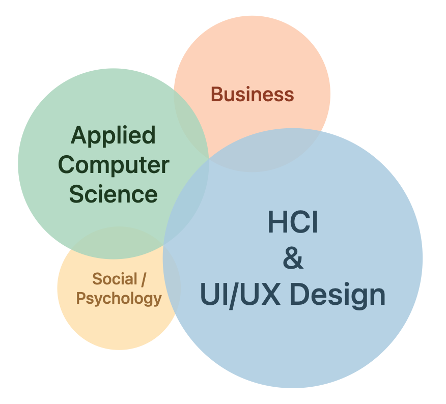
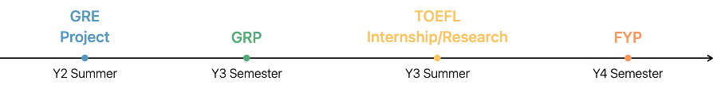

# CM@CornellTech – ZYH

## 基本信息 Basic Information

本科专业：BSc Computer Science (4+0)

申请学位：Master of Science

领域偏好：HCI, UI/UX, General CS, Software Engineering

最终去向：Cornell Tech – MS in Information Systems, Connective Media

## 申请三维 Application Information

均分（大一/大二/大三）：85/85/83 (WES GPA 4.0)

语言成绩：TOEFL 106 (L24+R29+W28+S25 | BS 111)

GRE：325 (V158+Q167+A3.5)

## 个人经历 Personal Academic Experiences

### 实习经历 Internship Experiences：

2024年Apple – MD Program Management为期四个月

2022年Volvo Cars – Connected Experience为期两个月

### 项目经历 Project Experiences：

2024-2025 FYP Cognitive Style-based Exploratory Search Engine (Supervised by Dr. Matthew Pike)

2023-2024 GRP Automated Marking and Feedback System (Supervised by Dr. Yuan Yao)

2023-2024 FURP Discover Ningbo WeChat Mini-Program Development (Backend & Database Dev)

### 荣誉奖项 Awards：

2024-2025 Provost's Scholarship

2023-2024 Provost's Scholarship

2022-2023 Provost's Scholarship

## 申请结果 Application Results

### Admission：

### Waitlist

### Rejection：

## 申请经验 Application Experience Sharing

### 选校选专业：

我个人的选项目的原则是“在自己喜欢的地方学自己想学的东西”，所以先挑地区城市再看项目的课程内容和培养方向。由于我对AIML不是非常有兴趣，传统CS在课程上对我的吸引力较差，我转而更多考虑了Information Systems 的几个项目，这样可以上更多HCI，UI/UX，甚至是一些MBA相关的课程（如下图），就业目标也从SDE扩大到Software PM这一块，与我的FYP项目、专业兴趣、硕士项目更加贴合。另外再选择专业/项目时建议多多参考往届飞跃手册或xhs分享中的申请时间线，不要把宝全压在出结果非常拖拉（包括但不限于offer从2月发到5月还没全部发完结果）的项目/学院上，以今年为例：Columbia Fu Engineering, CMU Engineering, USC, USCD等。

### 标化成绩准备：

大三前如果有空可以准备GRE（保320冲325，五年有效期），因为现在很多项目都是GRE optional甚至not required，所以花太多时间刷GRE的分数收效甚微。进入大三后就优先把托福考出来（100+可以覆盖多数美硕CS项目，105+则畅行无阻），如果主申美国的话请选择托福而非雅思，很多院校的雅思要求性价比极低。

### 推荐信准备：

我一共找了4位推荐人，校内PT+GRP+FYP导师，校外Apple实习老板；我申请的项目绝大多数都有明显的就业导向，3位推荐人的项目我提供了2学术+1实习，2位推荐人的项目我提供了1学术+1实习。我的推荐人都没有提交项目数量上的限制，但我还是建议事先和教授沟通好大致需要几封推荐信，不够的话还有时间找别的老师。

### 暑研/实习建议：

我认为尽早确定研究生项目的导向非常重要：如果以后要读PhD或继续做科研则在本科阶段尽可能积累科研经验，最好能有1-2篇产出；如果已就业为导向则可以吧重点放在实习或项目上，在精而不在多，2-3段可以展开详细讨论自己贡献与成长的经历远比6-7段止步于简历上的几行字来的宝贵。另外不论是科研还是实习，其内容和申请项目方向的匹配度也很重要，如果能在大二就确定自己未来的方向剩下两年的准备就能更加的有针对性。以下是我（推荐）的时间线，仅供参考。

### 其他建议：

GPA+语言成绩决定了申请结果的下限，而文书/推荐信/科研/实习则是锦上添花，不要本末倒置。所以我建议在学期中应优先稳住GPA，学有余力再冲科研或项目；同样在假期中如果有实习或暑研不要忽视语言成绩的准备。均分较占优势的话（e.g., 80+）可以不用申请过多保底校，感觉我这次浪费了很多申请费和送分费。这就是我所有的建议啦，祝大家都能申请到梦校，加油！